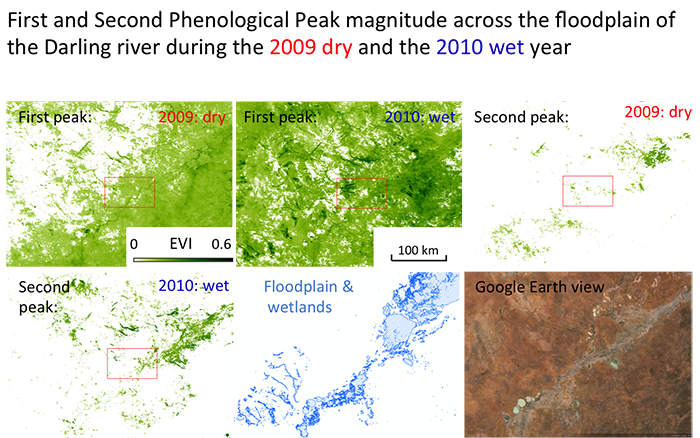
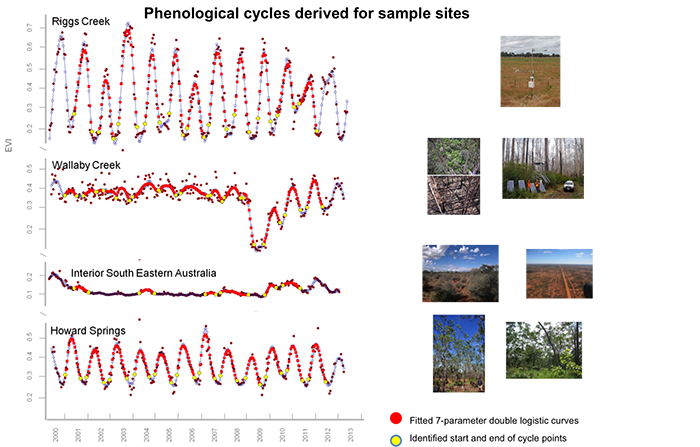
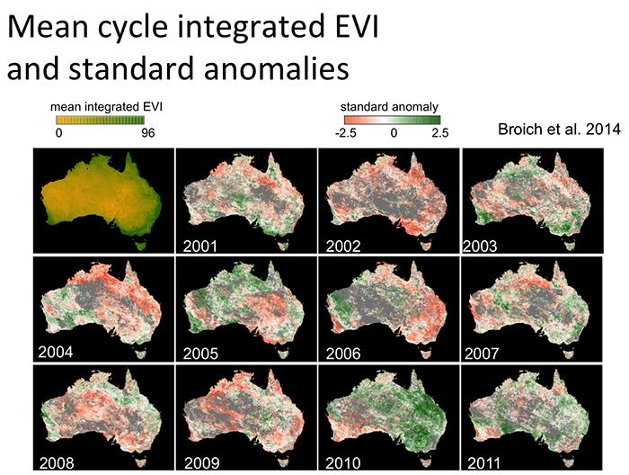

---
# Display name
title: Mark Broich

# Username (this should match the folder name)
authors:
- markbroich

# Is this the primary user of the site?
superuser: false

# Role/position
role: Postdoctoral Research Fellow

# Organizations/Affiliations
organizations:
- name: 
  url: ""

# Short bio (displayed in user profile at end of posts)
bio: Played a central research role on the Geospatial Analysis for Environmental Change team and had a key role in building the GAEC lab.

interests:
- Large area environmental remote sensing
- Spatial-temporal dynamics and change
- Forest loss
- GIS
- Vegetation dynamics
- Vegetation response to flooding

education:
  courses:
  - course: 
    institution: 
    year: 
  - course: 
    institution: 
    year: 
  - course: 
    institution: 
    year: 

# Social/Academic Networking
# For available icons, see: https://sourcethemes.com/academic/docs/page-builder/#icons
#   For an email link, use "fas" icon pack, "envelope" icon, and a link in the
#   form "mailto:your-email@example.com" or "#contact" for contact widget.
social:
- icon: envelope
  icon_pack: fas
  link: 'mailto:mark.broich@unsw.edu.au'
- icon: 
  icon_pack: 
  link: 

# Link to a PDF of your resume/CV from the About widget.
# To enable, copy your resume/CV to `static/files/cv.pdf` and uncomment the lines below.
# - icon: cv
#   icon_pack: ai
#   link: files/cv.pdf

# Enter email to display Gravatar (if Gravatar enabled in Config)
email: "mark.broich@unsw.edu.au"

education:
  courses:
  - course: PhD in Geospatial Science and Engineering
    institution: South Dakota State University
    year: 2010

# Organizational groups that you belong to (for People widget)
#   Set this to `[]` or comment out if you are not using People widget.
user_groups:
- Alumni
---

Dr. Mark Broich played a central research role on the Geospatial Analysis for Environmental Change team and had a key role in building the GAEC lab. As an innovative geospatial researcher he has extensive skills in quantitative spatial-temporal analysis and modelling of large datasets using remote sensing, geographic information systems (GIS), machine learning, spatial statistics and high performance computing (HPC). His far reaching international experience includes work in developing nations such as Indonesia and DR Congo. When he joined UNSW as a Postdoctoral Research fellow he worked on developing remote sensing algorithms quantifying surface water extent dynamics and vegetation response to flooding as part of an Australian Research Council Linage Grant and jointly supervise the lab’s three PhD students. 

His post doctoral research was titled "A novel approach for assessing environmental flows using satellite data (Australian Research Council Linkage Grant with the Murray-Darling Basin Authority)."

<b>Past Projects</b>

<b>Australian Research Council Linkage Grant working with Dr Mirela Tulbure:</b> "A novel approach for assessing environmental flows using satellite data". This project will determine how ecosystems respond to environmental flow by linking flooding history with vegetation responses, using remote sensing, climate data layers, spatial statistics, models of environmental flows and ecological theory. Beneficiaries will include water and land managers in Australia.

<b>AusCover/TERN satellite phenology product for Australia (v1):</b> In contribution to the Terrestrial Ecosystems Research Initiative’s AusCover remotes sensing facility, Mark developed Australia’s first remote sensing-based phenological characterization product (Broich et al. 2014 & 2015) in collaboration with the University of Technology Sydney.

<b>Forest cover loss in Indonesia and DR Congo:</b> Funded by NASA, USAID and AusAid, Mark Broich worked with Professor Matt Hansen (UMD) on quantifying humid tropical forest cover loss from Landsat and MODIS remote sensing time series (Broich et al. 2011a, 2011b and others) in contribution to the UN-REDD policy initiative.
//img
Photo of workshop at LAPAN. 

<b>Scholarships</b>
- First author paper selected for the ‘Highlights of 2011 Collection’ of Environmental Research Letters as per Journal Editors’ decision.
- Fire and Emergency Services Authority (FESA) of Western Australia Grant for the “GIS-Based Bushfire Threat Analysis of the Entire State of Western Australia” project (co-CI) [$168,000].
- University of New South Wales Start-up funds.
- German Academic Exchange Service Graduate Studies Abroad Scholarship for two semesters at the University of Hawaii, USA [$25,000].
- German Academic Exchange Service Travel Scholarship for thesis related fieldwork in Kenya [$5,000].
