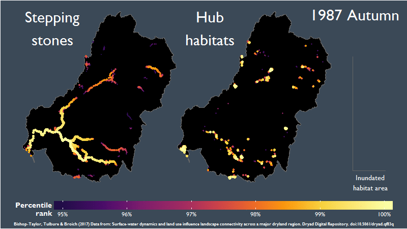
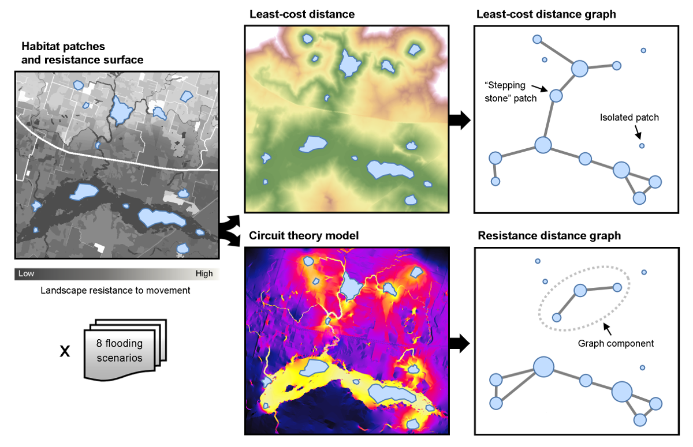
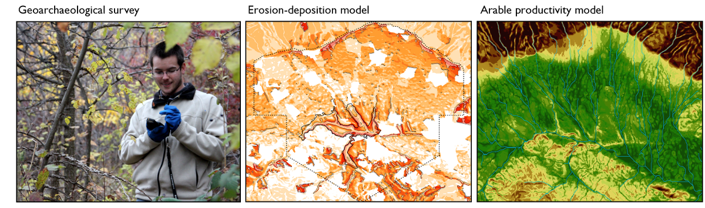

---
# Display name
title: Robbi Bishop-Taylor

# Username (this should match the folder name)
authors:
- robbibishoptaylor
  
  
# Is this the primary user of the site?
superuser: false

# Role/position
role: PhD Student

# Organizations/Affiliations
organizations:
- name: 
  url: ""

# Short bio (displayed in user profile at end of posts)
bio: Robbi currently works for Geoscience Australia's earth observation team, which can be seen <a href="https://www.ga.gov.au/scientific-topics/earth-obs"> here. </a>

interests:
- Spatiotemporal analysis
- landscape ecology
- ecological connectivity
- GIS
- graph theory
- network analysis
- geography

education:
  courses:
  - course: PhD in Geospatial Science
    institution: The University of New South Wales
    year: 2017

# Social/Academic Networking
# For available icons, see: https://sourcethemes.com/academic/docs/page-builder/#icons
#   For an email link, use "fas" icon pack, "envelope" icon, and a link in the
#   form "mailto:your-email@example.com" or "#contact" for contact widget.
social:
- icon: envelope
  icon_pack: fas
  link: 'mailto:r.bishop-taylor@unsw.edu.au'
- icon: twitter
  icon_pack: fab
  link: https://twitter.com/robbibt

# Link to a PDF of your resume/CV from the About widget.
# To enable, copy your resume/CV to `static/files/cv.pdf` and uncomment the lines below.
# - icon: cv
#   icon_pack: ai
#   link: files/cv.pdf

# Enter email to display Gravatar (if Gravatar enabled in Config)
email: ""

# Organizational groups that you belong to (for People widget)
#   Set this to `[]` or comment out if you are not using People widget.
user_groups:
- Alumni
---

Robbi currently works with Geoscience Australia's earth observation team. While working with the lab, he pursued his  interest in the natural world and the role landscape-scale research has to play in maintaining the viability of ecosystems increasingly impacted by development and environmental change. Particularly, he focused on how dynamic remote sensing datasets and network analysis can be used to study landscape connectivity through time and across large spatial extents, potentially providing a powerful and efficient mechanism for prioritising conservation within highly modified and increasingly contested landscapes.

<b>Past Projects</b>
Robbi's research focuses on modelling ecological connectivity between surface water habitats of the Murray-Darling Basin, one of the largest semi-arid agricultural basins in the world (> 1 million km2) and home to many of Australia's most significant freshwater ecosystems. Robbi uses graph theory network modelling to analyse connectivity, an advanced statistical framework which has recently seen a rapid uptake for analysing connectivity in terrestrial, marine and surface water systems. By combining graph theory modelling with over 25 years of newly available high-resolution remotely sensed surface-water datasets, this work will attempt to characterise spatiotemporal connectivity dynamics across the Murray-Darling at seasonal, yearly and decadal scales. It is anticipated the results of this research will contribute to current understanding of how habitat network structure, landscape conditions and dynamic events such as flooding combine to influence connectivity across space and time, and ultimately assist in prioritising critical surface water habitats for conservation (e.g. Figure 1).
<b>Figure 1</b> (based on data from Bishop-Taylor et al. 2017): The distribution of top-ranked surface water habitats for facilitating landscape connectivity across Australia's Murray-Darling Basin between 1986 and 2011. ​​Top-ranked "stepping-stones" (left) are habitats that support long-distance dispersal and gene flow for water dependent organisms, particularly during wet periods (i.e. 2010-2011 La Nina Floods) when newly flooded terrain can significantly improve connectivity through normally fragmented surface-water networks. Top-ranked "hub" habitats (right) represent highly connected habitats that support dispersal between clusters of neighbouring surface-water bodies, and which can potentially serve as important refugia during periods of drought (i.e. the 1997-2009 Millenium Drought).

From 2011 to 2013, Robbi worked collaboratively with an international team of environmental scientists, GIS specialists and landscape archaeologists on the Tundzha Regional Archaeological Project. He helped to design and conduct a multi-disciplinary geoarchaeological project involving extensive field work aimed at studying the paleoenvironmental landscape of an archaeologically significant region of central Bulgaria. During his Honours year, datasets collected in Bulgaria were analysed to model the socio-ecological consequences of past human habitation at varying temporal and spatial scales, and explore the dynamic and synergistic effects of climate change and agricultural intensification on historic land use patterns.

<b>Scholarships</b>
- NASA-MSU Professional Enhancement Award (Scholarship to attend World Congress of the International Association for Landscape Ecology)
- Outstanding Graphic Award, 2016 Research Excellence Awards (Evolution and Ecology Research Centre)
- Runner up, Outstanding Evolution and Ecology Presentation 2016 (Postgraduate Research Forum, UNSW)
- The Conservation Science Prize 2014 (Best presentation in conservation science at the Postgraduate Research Forum, UNSW)
- School of Biological, Earth and Environmental Sciences Postgraduate Conference Funding
- Australian Postgraduate Award (APA) with faculty top-up