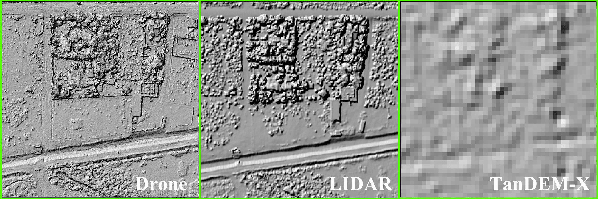
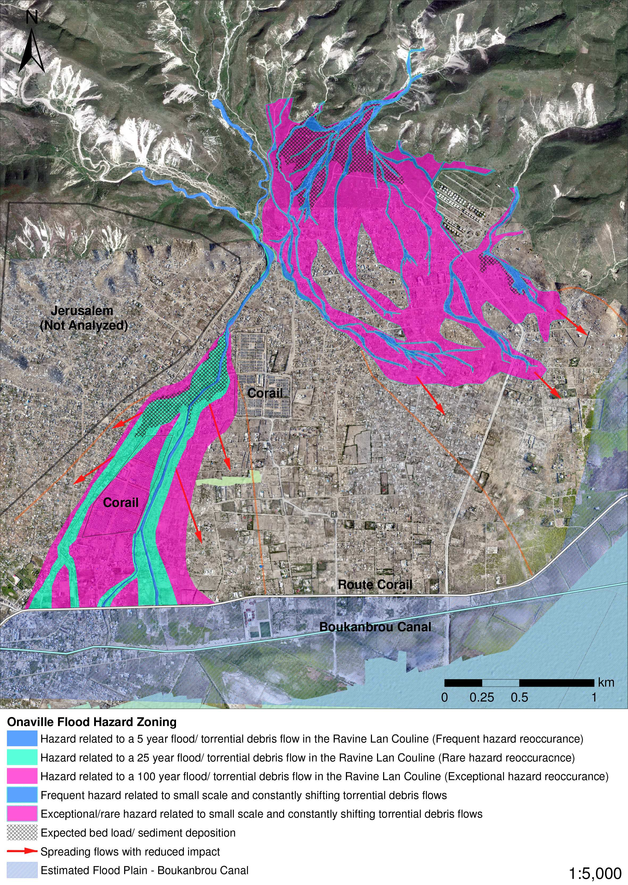

---
# Display name
title: Valentin Heimhuber

# Username (this should match the folder name)
authors:
- valentinheimhuber

# Is this the primary user of the site?
superuser: false

# Bold author name in authors list
highlight_name: true

# Role/position
role: PhD Student

# Organizations/Affiliations
organizations:
- name: 
  url: ""

# Short bio (displayed in user profile at end of posts)
bio: Valentin currently works at UNSW as a postdoctoral researcher in hydrology. See what he is up to now <a href="https://www.wrl.unsw.edu.au/staff/valentin-heimhuber"> here. </a>

interests:
- Spatial Methods in Hydrology
- Geospatial Analysis
- Flood Modelling

education:
  courses:
  - course: PhD in Hydrology and Remote Sensing
    institution: The University of New South Wales
    year: 2017

# Social/Academic Networking
# For available icons, see: https://sourcethemes.com/academic/docs/page-builder/#icons
#   For an email link, use "fas" icon pack, "envelope" icon, and a link in the
#   form "mailto:your-email@example.com" or "#contact" for contact widget.
social:
- icon: envelope
  icon_pack: fas
  link: 'mailto:valentin.heimhuber@unsw.edu.au'
- icon: twitter
  icon_pack: fab
  link: https://twitter.com/TurnThatAround

# Link to a PDF of your resume/CV from the About widget.
# To enable, copy your resume/CV to `static/files/cv.pdf` and uncomment the lines below.
# - icon: cv
#   icon_pack: ai
#   link: files/cv.pdf

# Enter email to display Gravatar (if Gravatar enabled in Config)
email: ""

# Organizational groups that you belong to (for People widget)
#   Set this to `[]` or comment out if you are not using People widget.
user_groups:
- Alumni
---
Valentin was awarded his PhD for his research, "Modelling surface water dynamics on large river basin scale from space: A case study for the Murray-Darling Basin of Australia." He was primarily supervised by Mirela G Tulbure with joint supervisor Mark Broich. 

Valentin currently works as a Post Doctoral Researcher in Hydrology at UNSW. 

As a researcher at GAEC, he was interested in the application of Earth observation data, remote sensing and statistical modeling for improving water resources management on globally significant scales. He was particularly passionate about the important role of innovative research and technology in providing the scientific evidence that is urgently needed for addressing the proliferation of the global freshwater crisis by informed policy making.

<b>Past Projects</b>

In his PhD at UNSW, he modelled surface water and inundation dynamics on large river basin scale, using a unique time-series of remotely-sensed surface water maps derived from Landsat imagery (1986 - 2012). This time-series was used in combination with river flow data and spatially explicit time-series of rainfall, evapotranspiration and soil-moisture, to perform a holistic analysis of the spatial and temporal distribution of surface water and its drivers across the Murray-Darling Basin, Australia’s largest and most important river basin. The resulting surface water models provide new insights into hydrological surface processes on sub-continental scale such as the retention and drying behaviour of large floodplains, the propagation of floods over large areas and the role of local rainfall, evapotranspiration and soil moisture for surface water dynamics. He then worked to incorporate MODIS data into the modeling framework to improve the models' ability to catpure rapid changes in flooding extent. 

In the first year of his PhD, he developed a new approach for modeling flooding dynamics across large river basins by combining a variety of satellite and in-situ data sets. The framework is highly-automated and easily applicable to other large river basins across the world such as the Amazon or Congo river basin. Details of the approach are given in the corresponding publication in <a href="https://hess.copernicus.org/articles/20/2227/2016/"> Hydrology and Earth System Sciences. </a>

In his second year, he added additional capabilities to the above-mentioned modeling approach and applied the new framework to model flooding dynamics and the role of hydrological key drivers in these dynamics across the entire Murray-Darling Basin, Australia's largest developed river system. The novel statistical modeling approach allowed us to accurately model the relationship between river flow and inundation extent across all major river and floodplain systems in the basin and revealed that in addition to river flow, local climate conditions influence the long-term dynamics of surface water particularly in the extended and unregulated floodplain systems in the northwest of the basin. Details of this modeling application are given in the corresponding publication in <a href="https://agupubs.onlinelibrary.wiley.com/doi/full/10.1002/2016WR019858"> Water Resources Research. </a>

His Master's thesis was part of the interdisciplinary research project "Urban Strategies for Onaville" at Technical University of Munich. In this study, he used GIS-based hydrologic and hydraulic modelling for estimating the flood hazard of the informal settlement Onaville (image below), which is a fairly new and rapidly growing informal settlement in Haiti that is exposed to dangerous flash-flood events.

Due to the limited data availability, he used a combination of state-of-the-art remote sensing-based digital elevation models to recreate the geometry of the river channel and the floodplains which is essential for modelling flood runoffs accurately. These data comprised a 12 m spatial resolution DEM provided by the TanDEM-X satellite mission of the German Aerospace Center (DLR), a 30 cm spatial resolution DEM created with mapping drones provided by Drone Adventures and a 1 m spatial resolution LiDAR DEM provided by the World Bank.

The hydraulic modeling software HEC-RAS was used to perform one-dimensional, unsteady-flow simulations of the design floods in the Ravine Lan Couline, which is the major drainage channel of the area and poses the larges flood related risk. 

The flow simulations revealed that large areas of the Onaville settlement are currently exposed to flood hazard. The results of the hydrologic and hydraulic modeling were incorporated into a flood hazard map which formed the basis for establishing a functioning flood risk management in Onaville.

Together with the NGO TECHO and local residents, he helped to establish a basic flood risk management for Onaville which comprised an awareness raising campaign, a flood contingency plan and the establishment of a network of flood risk representatives within the residents of Onaville. 
 

<b>Scholarships</b>
- 2017 Winner of School of BEES (UNSW) 3 Minute Thesis Competition (300AUD) Best 3-minute science talk during School of BEES postgraduate research forum
- E&ERC (UNSW) Outreach and Communication in Evolution and Ecology Award 2016 (200AUD) Award for outstanding achievement in communicating research to the broader community through popular media and outreach activity
- Winner of the MSSANZ best student poster prize at OzEWEX2016 (500AUD) The poster can be seen <a href="http://ozewex.org/workshop2016/wp-content/uploads/2017/01/Heimhuber.pdf"> here</a> and here <a href="http://ozewex.org/interview-with-valentin-heimhuber-winner-of-the-mssanz-student-poster-prize-at-ozewex2016/"> an interview about his research</a> following the award.
- Winner of the UNSW Science Postgraduate Research Competition 2016 (5000AUD research & travel funding). See the video of my presentation <a href="https://www.youtube.com/watch?v=kHSGXawUaSA"> here </a>.
- The Outstanding Ecosystem Science Presentation 2016 (200AUD) (Best presentation in ecosystem science at the Postgraduate Research Forum, UNSW)
- Postgraduate Research Student Scholarship (PRSS) (3000AUD) UNSW scholarship to present my PhD research at the 48th Annual American Geophysical Union Fall Meeting, 14-18 December 2015, San-Francisco, USA
- University International Postgraduate Award - UIPA (+8.000 p.a. Top-up) - Full-cost scholarship for international PhD candidates (University of New South Wales (UNSW), Sydney, Australia)
- <a href="https://www.cee.ed.tum.de/hydrologie/home/"> Heinz Peter Scholz Award 2014</a> - (3000 Euro) Award for special achievements in the Master’s program of Environmental Engineering (Technical University of Munich, Munich, Germany)
- ESRI Young Scholars Award 2014 - The ESRI Young Scholars program recognizes exemplary work of students majoring in geospatial science at international universities and invites awardees to present their research at the ESRI International User Conference (ESRI, California, USA) <a href="https://denverro.maps.arcgis.com/apps/MapTour/index.html?appid=f924c86d995346aba8d071f74718a3da"> [Site] </a>
- Scholarship for Research Activities in Development Countries - Travel Scholarship for thesis related fieldwork in Haiti (Technical University of Munich)
- PROMOS Scholarship - Scholarship for exchange semester at Stellenbosch University, South Africa (German Academic Exchange Service (DAAD) and Technical University of Munich)