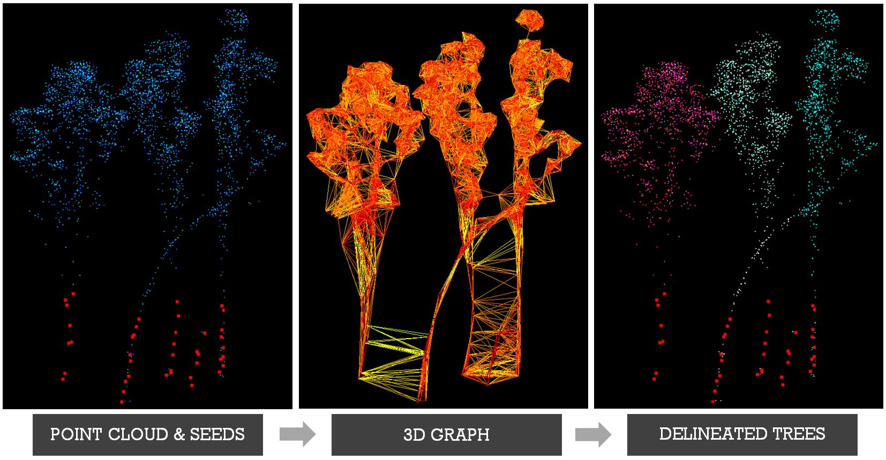
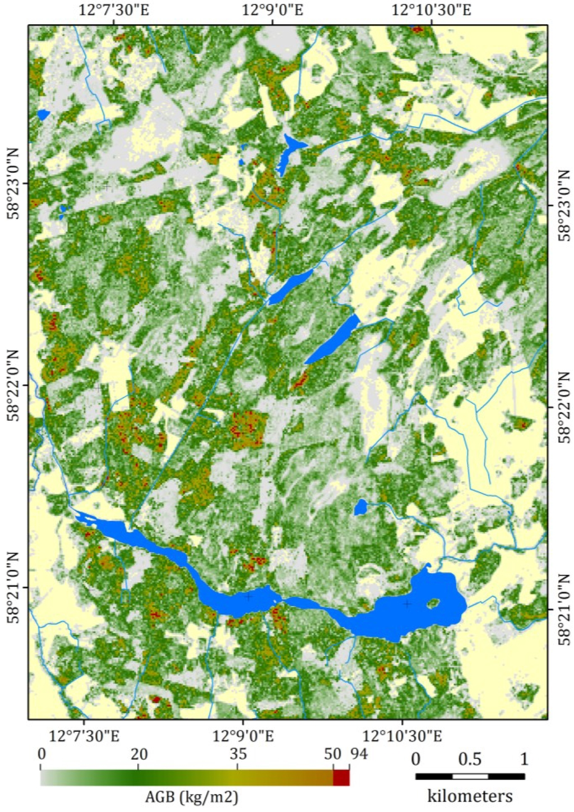

---
# Display name
title: Yuri Shendryk

# Username (this should match the folder name)
authors:
- yurishendryk

# Is this the primary user of the site?
superuser: false

# Role/position
role: PhD Student

# Organizations/Affiliations
organizations:
- name: 
  url: ""

# Short bio (displayed in user profile at end of posts)
bio: Yuri currently works for Dendra Systems which uses data processing to monitor and restore ecosystems. You can read more about this work <a href="https://dendra.io/"> here. </a>

interests:
- Remote Sensing
- GIS
- LiDAR
- Forestry

education:
  courses:
  - course: PhD in Remote Sensing and Forestry
    institution: The University of New South Wales
    year: 2017

# Social/Academic Networking
# For available icons, see: https://sourcethemes.com/academic/docs/page-builder/#icons
#   For an email link, use "fas" icon pack, "envelope" icon, and a link in the
#   form "mailto:your-email@example.com" or "#contact" for contact widget.
social:
- icon: envelope
  icon_pack: fas
  link: 'mailto:iurii.shendryk@gmail.com'

# Link to a PDF of your resume/CV from the About widget.
# To enable, copy your resume/CV to `static/files/cv.pdf` and uncomment the lines below.
# - icon: cv
#   icon_pack: ai
#   link: files/cv.pdf

# Enter email to display Gravatar (if Gravatar enabled in Config)
email: ""

# Organizational groups that you belong to (for People widget)
#   Set this to `[]` or comment out if you are not using People widget.
user_groups:
- Alumni
---
Yuri was awarded his PhD for his research, "Integration of multi-sensor remote sensing data for assessment of environmental flows in the Barmah-Millewa Forest." He was primarily supervised by Mirela G Tulbure with joint supervisor Mark Broich.

Yuri currently works as a remote sensing/ machine learning Post Doctoral researcher focusing on precision agriculture at Australia's Commonwealth Scientific and Industrial Research Organisation. 

As a member of the lab he was a PhD candidate at the University of New South Wales (UNSW) and with the intention to improve the quality of natural environments through his work. On his journey to this goal, he develop high-tech algorithms to process terabytes of satellite data enabling us to make decisions for a sustainable future. His research was focused on the integration of remote sensing, Geographic Information Systems (GIS) and spatial statistics to explore interactions between species, environment and land use, with ongoing research and capacity building work focused on forest health monitoring.

<b>Past Projects</b>

In his PhD, Yuri and the rest of the GAEC team explored the potential of air- and space-borne remote sensing in characterizing and monitoring of forest health at multiple scales. They conducted experiments in the largest river red gum forest in the world, located in the south-east of Australia that has experienced episodes of severe dieback over the past six decades. First, they proposed a new algorithm that utilized airborne laser scans (ALS) for delineating individual trees with complex shapes, such as eucalypts. The algorithm was able to accurately delineate up to 68% of trees depending on forest and ALS point density. Second, they investigated the utility of ALS and imaging spectroscopy (IS) in classifying individual tree health and diagnosing potential causes of forest health decline. The results showed that the health of individual trees could be classified with an overall accuracy of 81% and a kappa score of 0.66, and highlighted that infrequently flooded areas were most susceptible to tree health decline. Finally, they assessed how ALS, Synthetic Aperture Radar (SAR) and multispectral imagery can predict individual tree health on a large scale. Yuri's findings demonstrated that individual tree health could be scaled up with substantial level of accuracy (R2 of 0.6). Overall, the results provided a robust and peer-reviewed methodology that utilized air- and space-borne remote sensing to accurately classify the health of individual trees on multiple scales. A step-be-step video of the methodology developed in his PhD can be found <a href="https://www.youtube.com/watch?v=xI937fpA7mM"> here</a>

Yuri used airborne laser scanning (ALS) and imaging spectroscopy (IS) technologies to characterizethe the largest river red gum forest in the world, located in the southeast of Australia. The aim of his research was to quantify health at the individual tree level, which could be further used to dermine the response of this forest to environmental flows. As part of this project he developed a novel algorithm for individual tree crown delineation from ALS based on graph theory. The graphical abstract of the algorithm is presented below.
 

In 2013, Yuri worked on the development of hydrologic monitoring strategy using remote sensing data in contribution to the TERENO-MED network of Global Change observatories at the Helmholtz Centre for Environmental Research (<a href="https://www.ufz.de/index.php?en=33573">UFZ</a>) in Germany.

In 2012, Yuri developed a method for assessing above ground biomass (AGB) of boreal forests in Sweden using a synergy of low point density LiDAR-derived point cloud data and multi-spectral imagery as part of Landscape Greenhouse Gas Exchange (LAGGE) project led by the Department of Earth Sciences, Gothenburg University and the Department of Physical Geography and Ecosystem Science, <a href="https://www.nateko.lu.se/">Lund University</a>. The AGB map for June 2011 over the Skogaryd Research Catchment is presented below.
 

<b>Scholarships</b>
- Tuition Fee Scholarship (TFS) scholarship to undertake a PhD research at the University of New South Wales
- Postgraduate Research Student Scholarship (PRSS) to present my PhD research at the 47th Annual American Geophysical Union Fall Meeting, 15-19 December 2014, San-Francisco, USA
- DigitalGlobe Foundation WorldView-2 imagery grant to support my research efforts
- <a href="https://esriaustralia.com.au/esri-young-scholar-award#EYSA_2016">Esri Young Scholars Award 2016</a> to present my PhD research at the Esri User Conference, 27 June - 01 July, San Diego, USA
