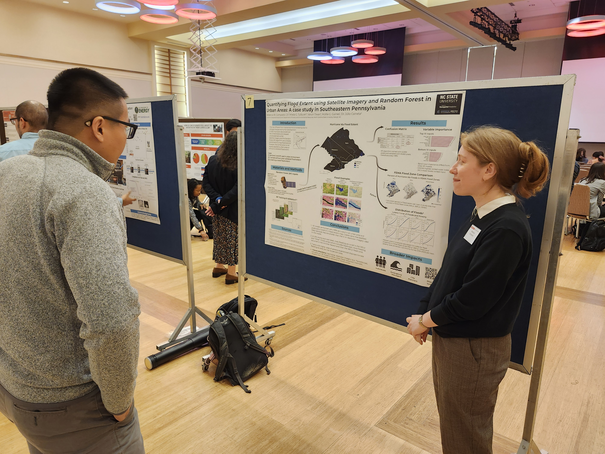

Lab members Rebecca and Varun presented posters on their current research projects at the 5th annual CNR Graduate Research Symposium this week.

<!--more-->

Rebecca presented on her research "Quantifying Urban Flooding Extent Using Satellite Imagery and Population Impacted After Hurricane Ida in Philadelphia, PA", which she has also presented at AGU 2023.

Varun discussed his research "Advancing Food Security in Bangladesh: A Framework for Rice Yield Estimation using Time Series Optical Data with Machine Learning Algorithm".

<!-- ## Social Media Buzz:
<blockquote class="twitter-tweet">
Super proud of my lab&#39;s Ph.D. students presenting at the <a href="https://twitter.com/NCStateCNR?ref_src=twsrc%5Etfw">@NCStateCNR</a> graduate research symposium, on <a href="https://twitter.com/hashtag/floods?src=hash&amp;ref_src=twsrc%5Etfw">#floods</a>, how future climate and land use change scenarios will impact surface <a href="https://twitter.com/hashtag/water?src=hash&amp;ref_src=twsrc%5Etfw">#water</a> resources in the southeastern US, &amp; <a href="https://twitter.com/has -->
