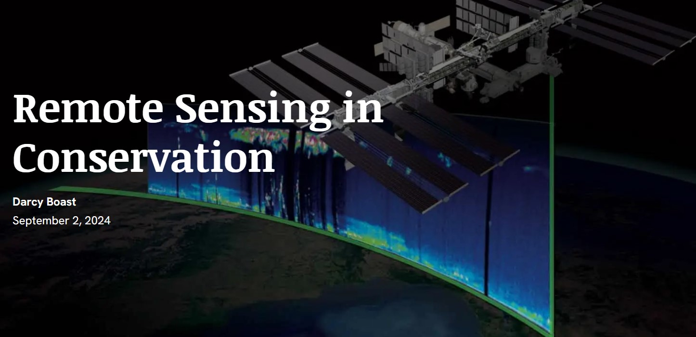

The GAEC lab welcomes Darcy Boast as its newest undergraduate research assistant.  

<!--more-->

Darcy is a junior pursuing a Bachelor of Science degree in Environmental Sciences with a GIS focal area. She is passionate about GIS and excited to further her knowledge of remote sensing and the research being done in the GAEC lab. 

Darcy worked with <a href = "https://gaec-lab.netlify.app/author/mollie-d.-gaines/"> Dr. Mollie Gaines</a> before her <a href = "https://gaec-lab.netlify.app/post/24-07-01-mollie-pass/"> successful PhD defense</a>. In the third chapter of Dr. Gaines’ dissertation, “Comparing high and moderate resolution satellite-based seasonal surface water extents in headwaters using machine learning”, Darcy created training and testing data for a machine learning algorithm to quantify surface water. 

She also completed independent research on remote sensing applications in conservation, which is a passion of hers. Topics included monitoring of coral reefs, species abundance tracking and mapping of wildfire retardant, among others. The culmination of this work was a <a href = "https://arcg.is/0XGfGa0"> storymap</a> made using ArcGIS. 

Outside of studying and lab work, Darcy plays on the women’s ultimate frisbee team at NC State and enjoys fitness kickboxing. She is also fond of baking, crochet, and playing the guitar. She works as a barista on the weekends and loves coffee and tea. 

The GAEC lab looks forward to having Darcy as part of the team for the fall semester.  

<!-- ## Social Media Buzz:
<blockquote class="twitter-tweet">
Super proud of my lab&#39;s Ph.D. students presenting at the <a href="https://twitter.com/NCStateCNR?ref_src=twsrc%5Etfw">@NCStateCNR</a> graduate research symposium, on <a href="https://twitter.com/hashtag/floods?src=hash&amp;ref_src=twsrc%5Etfw">#floods</a>, how future climate and land use change scenarios will impact surface <a href="https://twitter.com/hashtag/water?src=hash&amp;ref_src=twsrc%5Etfw">#water</a> resources in the southeastern US, &amp; <a href="https://twitter.com/has -->

