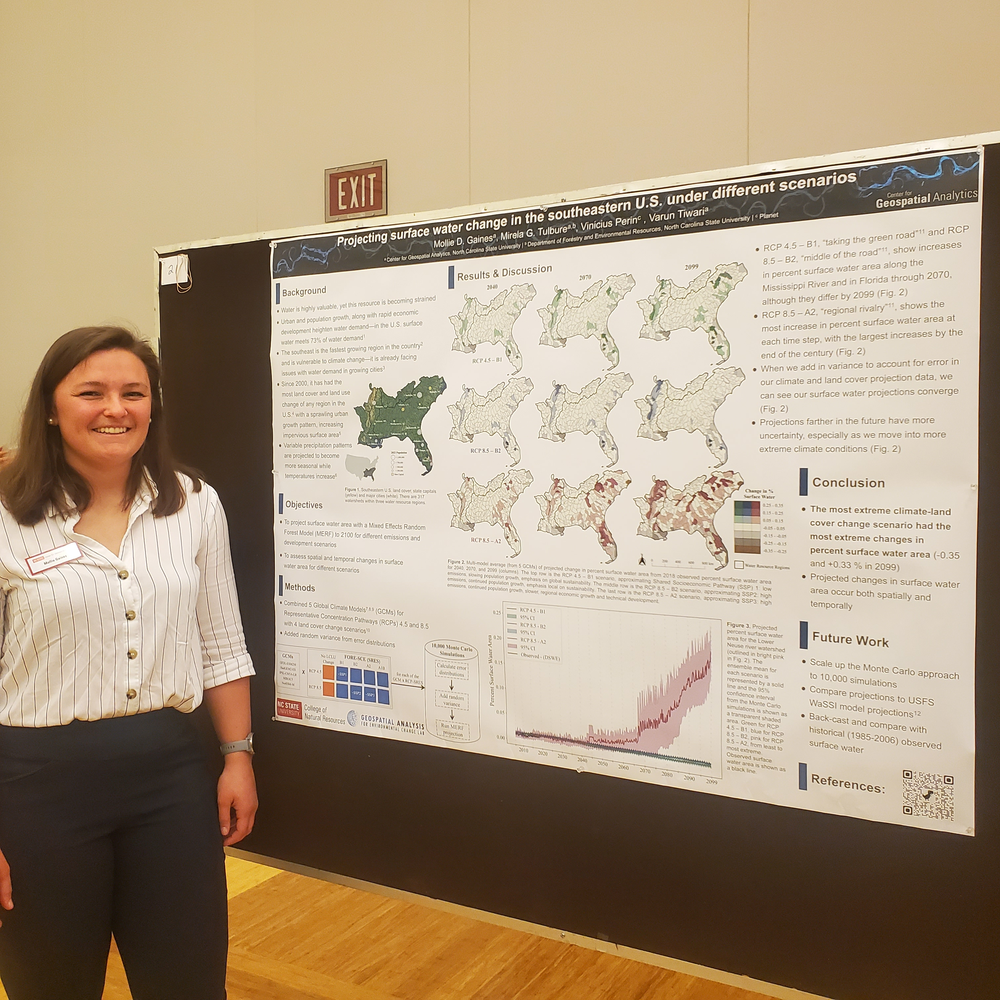

Lab members Mollie, Rebecca, and Varun presented posters on their current research projects at the 5th annual CNR Graduate Research Symposium this week.

<!--more-->

Mollie's poster was titled "Projecting surface water change in the southeastern U.S. under different scenarios" and her research can be read about more <a href="../22-03-28-mollie-climate-water/">here</a>!

Rebecca presented on her research "Quantifying Urban Flooding Extent Using Satellite Imagery and Population Impacted After Hurricane Ida in Philadelphia, PA"

Varun discussed his research "Rice area mapping in Bangladesh: Harnessing the power of time-series of Sentinel data and Google Earth Engine" which he also presented at the AGU, featured in <a href="../22-12-11-agu-22/">this post</a>.

## Social Media Buzz:
<blockquote class="twitter-tweet">
Super proud of my lab&#39;s Ph.D. students presenting at the <a href="https://twitter.com/NCStateCNR?ref_src=twsrc%5Etfw">@NCStateCNR</a> graduate research symposium, on <a href="https://twitter.com/hashtag/floods?src=hash&amp;ref_src=twsrc%5Etfw">#floods</a>, how future climate and land use change scenarios will impact surface <a href="https://twitter.com/hashtag/water?src=hash&amp;ref_src=twsrc%5Etfw">#water</a> resources in the southeastern US, &amp; <a href="https://twitter.com/hashtag/rice?src=hash&amp;ref_src=twsrc%5Etfw">#rice</a> mapping in <a href="https://twitter.com/hashtag/Bangladesh?src=hash&amp;ref_src=twsrc%5Etfw">#Bangladesh</a> <a href="https://t.co/zbCQoWOLdr">https://t.co/zbCQoWOLdr</a> <a href="https://t.co/HYWnsT94le">https://t.co/HYWnsT94le</a>
&mdash; Dr. Mirela G. Tulbure 🛰 🌠+ ğŸ + 🌊 (@MirelaGTulbure) <a href="https://twitter.com/MirelaGTulbure/status/1633952350368047104?ref_src=twsrc%5Etfw">March 9, 2023</a></blockquote> 