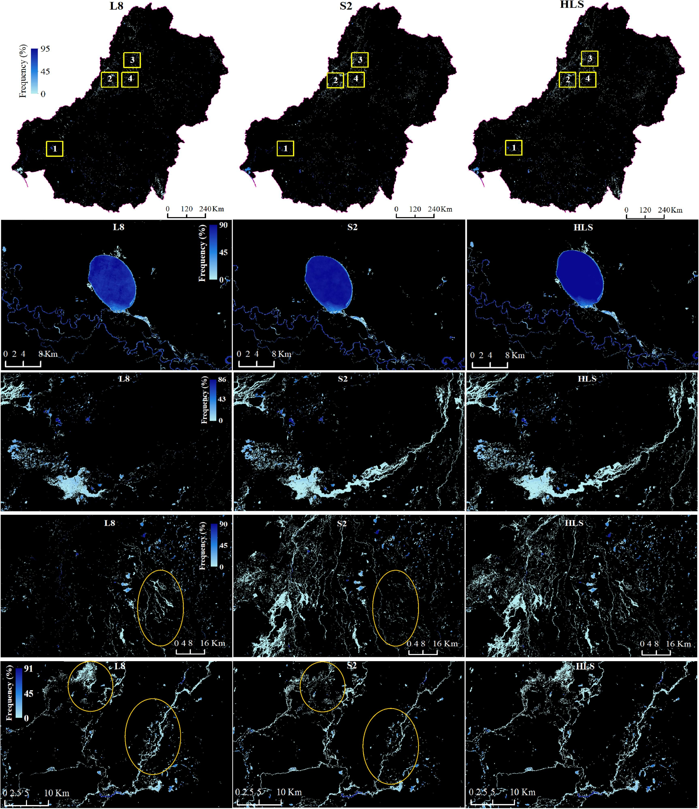

The journal article <i>Can we detect more ephemeral floods with higher density harmonized Landsat Sentinel 2 data compared to Landsat 8 alone?</i> was selected for the 2022 Highlights in ISPRS.

<!--more-->
Every year the Editors-in-Chief of the ISPRS Journal of Photogrammetry and Remote Sensing select one article from each month to be higlighted. The highlighted article for each month then becomes freely available for one year. Our lab's paper was one of the 12 papers selected during 2022 to be highlighted. The paper was written by several scientists from different universities, including our lab’s PI, Dr. Mirela Tulbure, lab alumnus, Dr. Vinicius Perin and current Ph.D. student, Mollie Gaines. The article recaps research that applied machine learning to NASA’s Harmonized Landsat Sentinel-2 (HLS) Surface Reflectance Product. They found that using three sensors, and therefore increasing the temporal frequency of imagery, improved the ability to detect surface water and flooding extent compared to using a single sensor. Using the study area of the Australia’s Murray-Darling Basin, a large dryland basin with frequent ephemeral floods, the they were able to map water with an accuracy of 99%.

Check out the <a href="https://www.sciencedirect.com/science/article/pii/S0924271622000338">article</a> and the rest of the ISPRS 2022 Highlights <a href="https://www.journals.elsevier.com/isprs-journal-of-photogrammetry-and-remote-sensing/featured-articles/2022-featured-articles">here</a>.

