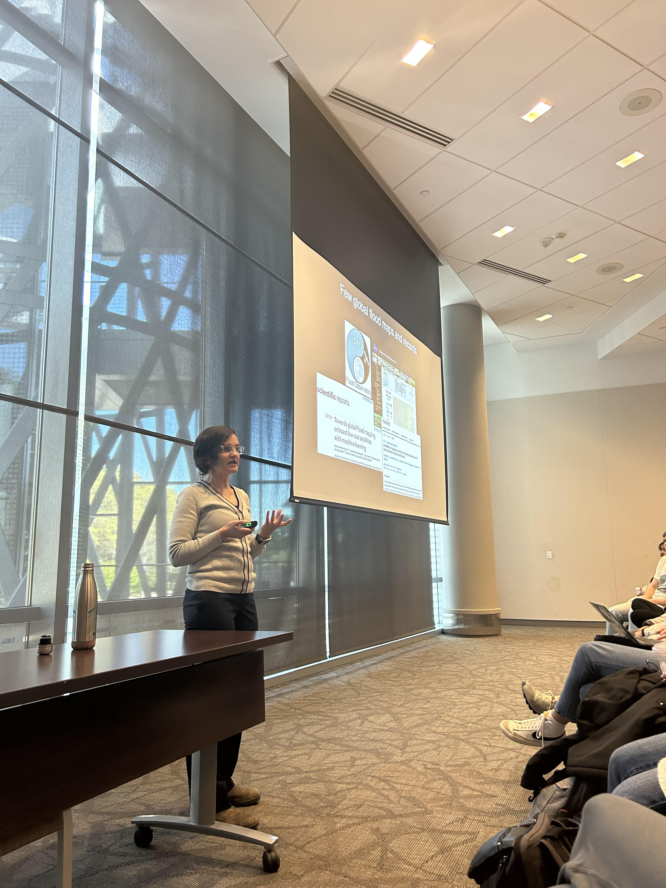

Mirela explained some of the labs research projects to undergraduate students in the NC State University Honors Program interested in global flooding. 

<!--more-->

Much of the audience was freshman students still exploring their interests, so the hope is that some may be encouraged to learn more about remote sensing and global flooding.
