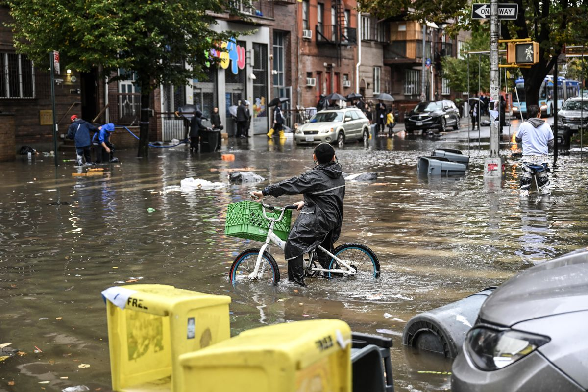

**Data Science Engineer**
<!--more-->

Are you passionate about harnessing technology and scientific innovation to make a meaningful impact in disaster information systems? Join our dynamic team on a  NASA-funded project focused on mapping flood events using earth-observing satellites. You will play a key role in developing and advancing a data pipeline essential for processing large-scale satellite imagery.

**This position is an excellent fit for:**

- Junior professionals or current graduate students in data or computer science, eager to apply their expertise to a project with significant social impact.

- If you are a recent Ph.D. graduate in data or computer science, the position can be at the postdoctoral level

**Position Requirements:**

- Prior experience in AWS data engineering. Applicants with prior experince in data engineering on a different platform other than AWS but strong interest in AWS will also be considered.

- Proficiency in writing well-structured and comprehensively documented Python code.

- A background in or enthusiasm for computer or data science/engineering.

This full-time role is initially offered for six months, with the potential for extension based on funding availability. The role can be remote and starting date is flexible.

**How to Apply:**

Please send your resume, a link to your GitHub portfolio (including a Python project sample), and unofficial transcripts to Mirela Tulbure at mtulbure@ncsu.edu. Use the subject line: "Application for Data Science Engineer Position".

<!--more-->
