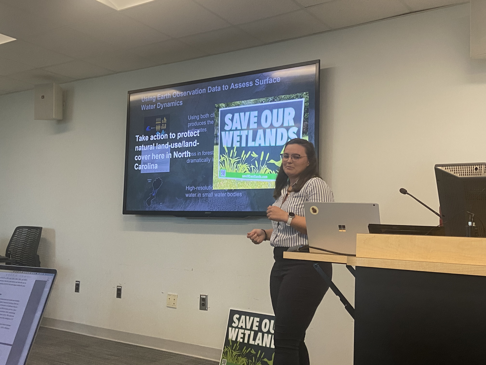

Dr. Gaines worked to quantify surface water in the southeastern United State in three PhD chapters. 

<!--more-->

Dr. Gaines has officially earned her doctorate in Geospatial Analytics at North Carolina State University. Her research uses satellite imagery and climate data to model and predict surface water area in the southeastern United States. Her dissertation chapters are as follows:
1. <a href="https://agupubs.onlinelibrary.wiley.com/doi/full/10.1029/2021WR031484">Effects of Climate and Anthropogenic Drivers on Surface Water Area in the Southeastern United States</a>
2. Projecting surface water area under different climate and development scenarios
3. Comparing high and moderate resolution satellite-based seasonal surface water extents in  headwaters using machine learning

The first two chapters of her dissertation dive into different climate and land use scenarios. During her defense, she reminded people that they can be part of the solution to climate change by <a href="https://act.southernenvironment.org/dskk9hc?p2asource=ActionCenter">making their voices heard</a> about the importance of land use, including forests and wetlands, for regulating surface water.

Dr. Gaines presenting and explaining importance of land use and forests.

During her time as a graduate student Dr. Gaines served as President of the department's Graduate Student Organization, provided teaching assistance for both undergraduate and graduate level geospatial classes, won an American Geophysical Union award and completed a NOAA internship. Outside of research, she can be found outside playing soccer and rowing.

After defending this summer, Dr. Gaines will be starting a PostDoctoral position with Dr. Mirela Tulbure on a <a href="https://gaec-lab.netlify.app/project/methane-small-water-bodies/">NASA funded project</a> related to better estimating methane emissions from small water bodies. 

### Social Media Buzz:

<blockquote class="twitter-tweet">
Congratulations to the newly minted PhD, Dr. Mollie Gaines, for this huge milestone!  Mollies PhD work focused on detecting, modeling, and projecting surface <a href="https://twitter.com/hashtag/water?src=hash&amp;ref_src=twsrc%5Etfw">#water</a> dynamics in the southeastern USA using <a href="https://twitter.com/hashtag/satellite?src=hash&amp;ref_src=twsrc%5Etfw">#satellite</a> imagery, <a href="https://twitter.com/hashtag/climate?src=hash&amp;ref_src=twsrc%5Etfw">#climate</a>, and land use/land cover data. <a href="https://t.co/TqjL5ig1kW">pic.twitter.com/TqjL5ig1kW</a>
&mdash; Dr. Mirela G. Tulbure 🛰 🌎 + 🐍 + 🌊 (@MirelaGTulbure) <a href="https://twitter.com/MirelaGTulbure/status/1806420806806753736?ref_src=twsrc%5Etfw">June 27, 2024</a></blockquote> 
