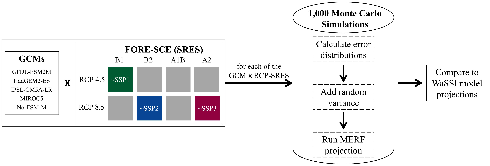

The paper, <a href = "https://agupubs.onlinelibrary.wiley.com/doi/full/10.1029/2024EF004625"> Projecting Surface Water Area Under Different Climate and Development Scenarios</a>, was published on July 19, 2024 in <i>Earth's Future</i>. This study is the second data chapter of Mollie Gaines' dissertation.

<!--more-->

In this study, we explored the possible future impacts of climate and anthropogenic drivers on surface water by projecting surface water areas at the watershed scale for the southeastern U.S. We projected seasonal surface water areas for eight different climate and development scenarios from 2006-2099 using a data driven model. We trained a Mixed Effects Random Forest (MERF) model using observational climate and land-use/land-cover (LULC) data as explanatory variables, with seasonal composites of the Landsat-derived Dynamic Surface Water Extent as our response variable. We created our scenarios using a matrix architecture to combine projections of climate change with projections of LULC change (see image below). We also increased the generalization of the model by adding variance to the explanatory variables in a Monte Carlo simulation.

A highlight of this study was the "finding that the scenario with the most forest-dominated LULC loss showed the greatest overall increase \[percent surface water area], and the scenario with the least forest-dominated LULC loss showed the least change" <a href = "https://agupubs.onlinelibrary.wiley.com/doi/full/10.1029/2024EF004625"> Gaines et al. (2024)</a>. This quote from the article sums up our findings:

> "Our projections underscore the importance of LULC—particularly forest-dominated areas—on surface water areas, suggesting that LULC management can be an effective tool in adaptation and mitigation. These results suggest that LULC management practices, particularly forest conservation, can impact SWA, water supply, and water management. Using a scenario-matrix architecture to project seasonal SWAs provides a wide range of possible trends for water managers to consider and can enable a more robust preparation of water use policies to manage surface water resources. This method can be applied to other regions, scaled up to a country-wide level, and applied at a sub-watershed scale. Scenario-based projections of SWA can help decision-makers assess the impacts of potential future changes in LULC and climate on water supply. Thus, they can assist in management and adaptation efforts generally and preparation for future hazardous events such as seasonally linked increases in droughts and floods." <a href = "https://agupubs.onlinelibrary.wiley.com/doi/full/10.1029/2024EF004625"> Gaines et al. (2024)</a>

### Bibliographic Citation

Gaines, M. D., Tulbure, M. G., Perin, V., Composto, R., & Tiwari, V. (2024). Projecting surface water area under different climate and development scenarios. Earth's Future, 12, e2024EF004625. https://doi.org/10.1029/2024EF004625

