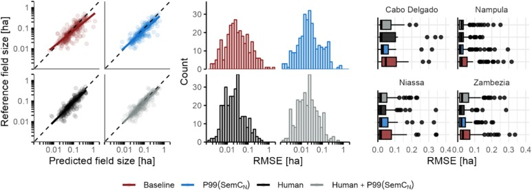

A new paper on field delineation of smallholder farms has been published, in which Dr. Tulbure is a co-author.

<!--more-->

Dr. Ruffin from the <a href = "https://landsystems-lab.earth/"> Land Systems for Sustainability Lab</a> in Berlin, Germany, led the paper. There were also co-authors from the Massachusetts Institute of Technology, the Eduardo Mondlane University, the Thünen-Institute of Farm Economics, and the Earth and Life Institute. 

### Social Media Buzz:

<blockquote class="twitter-tweet">
Smallholder field delineation based on <a href="https://x.com/hashtag/earthobservation?src=hashtag_click">#earthobservation</a> &amp; <a href="https://x.com/hashtag/deeplearning?src=hashtag_click">#deeplearning</a> is challenged by a need for more training data.  Pseudo-labels support domain adaptation across geographies &amp; sensors.  Pre-print led by Dr. Rufin <a href="https://t.co/BT4rUWySHr">  <a href="https://x.com/hashtag/computervision?src=hashtag_click">#computervision</a> <a href="https://x.com/hashtag/eochat?src=hashtag_click">#eochat</a> <a href="https://t.co/XpIUx5TieY">pic.twitter.com/XpIUx5TieY</a>
&mdash; Dr. Mirela G. Tulbure 🛰 🌎 + 🐍 + 🌊 (@MirelaGTulbure) <a href="https://twitter.com/MirelaGTulbure/status/1736805134968271305?ref_src=twsrc%5Etfw">December 18, 2023</a></blockquote> 

The main goal of this paper is to improve the availability of labeled data for smallholder landscapes in Northern Mozambique. Smallholder farms (less than 2 ha) produce 30-34% of the global food supply, yet there is a shortage of labeled data for these areas. Compared to larger scale agricultural landscapes, smallholder farms tend to have more diverse crops, higher biodiversity and higher land productivity. At the same time, they are contributing to deforestation in the tropics. Better understanding of land use in smallholder farms will help to analyze their environmental and economic impact. 

The researchers used high-resolution imagery. Field delineation is complicated in smallholder farms because of irregular boundaries and fragmentation. Human annotators created labels which were supplemented with machine-generated pseudo-labels. Pseudo-labels are predicted by a model when there is a gap in manually labeled data. They can help improve model performance by increasing the available training data. A machine learning algorithm was trained using the pseudo-labels to delineate field boundaries and estimate field sizes.

When the pseudo-labels were compared against human-annotated labels, they performed well in field delineation and size estimation – regional fine-tuning and complementing human annotations with pseudo-labels both increased performance. 

This paper shows how pre-trained field delineation models can create useful pseudo-labels for adapting to new regions. Human-annotated labels can help further improve performance. The researchers highlight the potential use of combining human and pseudo-labels for field delineation.

You can read the full article <a href = "https://kwnsfk27.r.eu-west-1.awstrack.me/L0/https:%2F%2Fauthors.elsevier.com%2Fsd%2Farticle%2FS1569-8432(24)00503-X/1/01020191ec79a8cc-588d79a4-4970-4a8d-98c0-4cecfd6ab72d-000000/yN_mVO7o9wKNPQqE_XZqdNeUhaE=391"> here</a>. 
