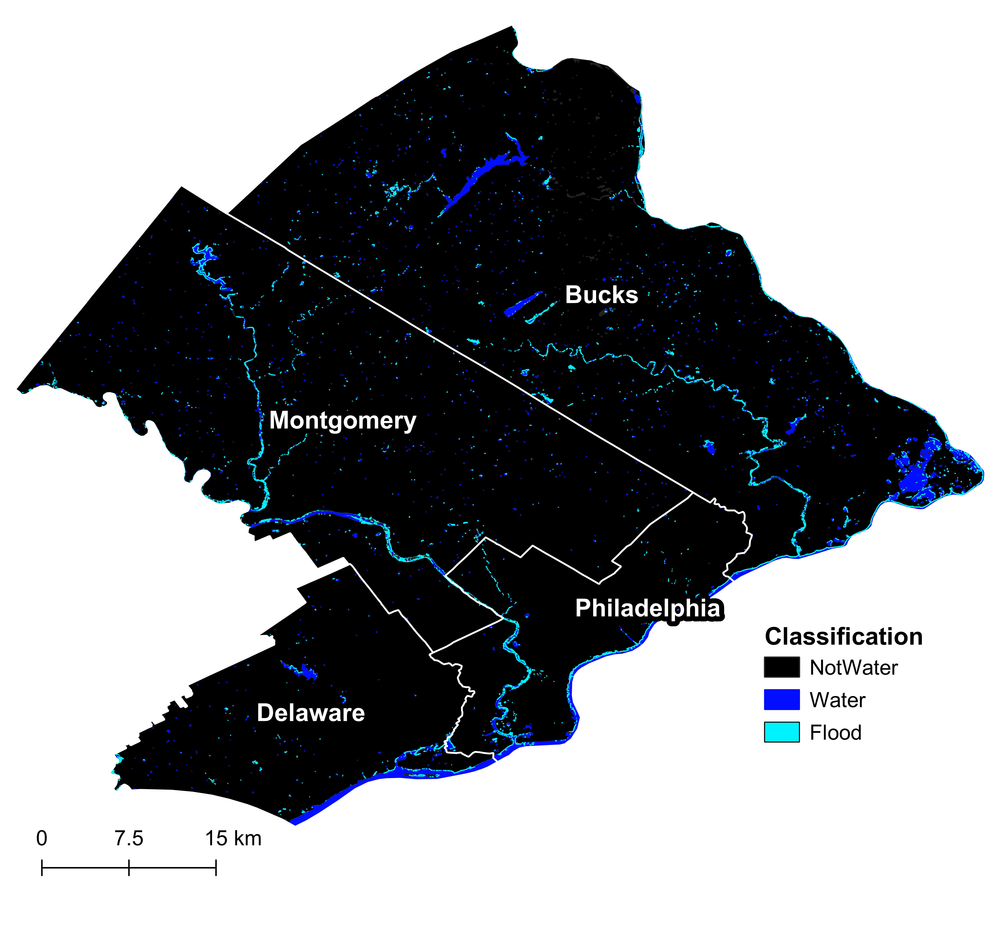

Ph.D. Student Rebecca Composto recently received a combined $25k in funding from a grant and scholarship. Rebecca’s research focuses on flooding and emergency preparedness in urban areas. In her <a href = 'https://gaec-lab.netlify.app/publication/2024-08-01-nh-composto/'> first Ph.D. paper</a>, she created a <a href = 'https://experience.arcgis.com/experience/3d12e11db70740d28a52b29f33c9f1a7/'>flood extent map</a> of southeastern Pennsylvania for Hurricane Ida.

<!--more-->

Rebecca was awarded $10,000 from the <a href = 'https://ncspacegrant.ncsu.edu/2024/07/17/north-carolina-space-grant-selects-2024-2025-graduate-research-fellows/'>NC Space Grant</a> for her research. 22 graduate students from across North Carolina were selected to become 2024-2025 graduate research fellows and conduct research that benefits NASA. The funding was awarded for a research project to quantify hurricane flood extents and depths in urban areas around North Carolina. 

She was also awarded $15,000 from the <a href = 'https://usgif.org/recognizing-excellence-2024-usgif-sponsored-scholarship-recipients/'>United States Geospatial Intelligence Foundation (USGIF)</a>. Rebecca was selected for the Stu Shea USGIF Endowed Scholarship, which is awarded annually to a Ph.D. student in geospatial studies.

Rebecca plans to use this funding to continue studying floods in urban areas and travel to conferences, including the up-coming American Geophysical Union (AGU) conference in December 2024.