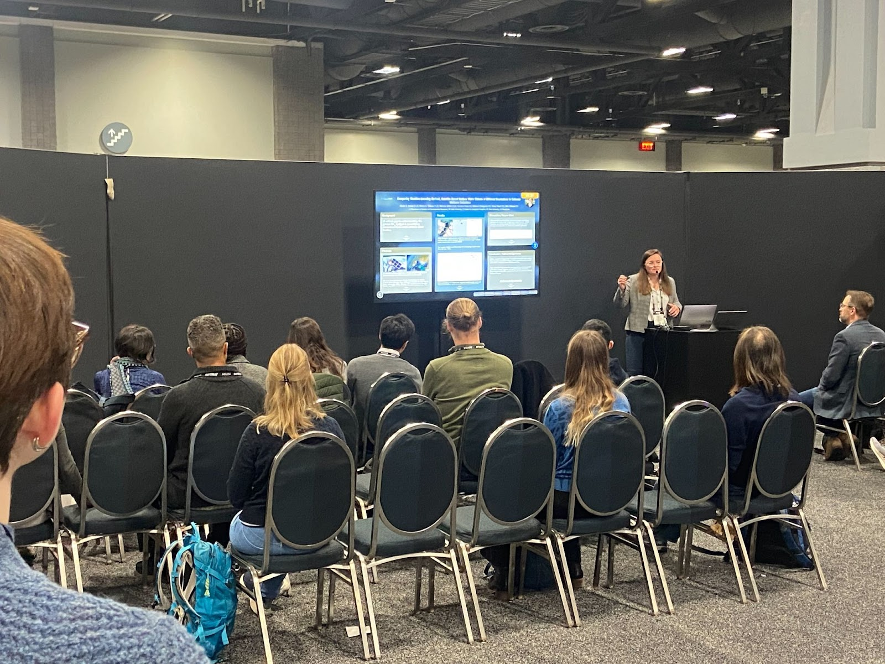
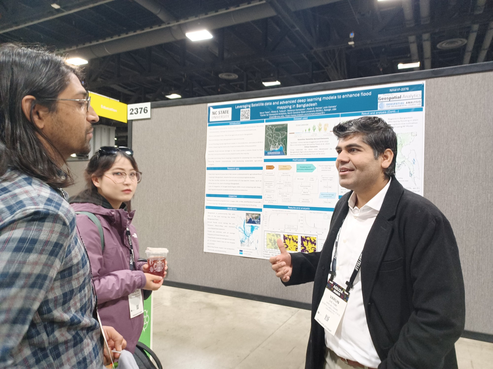

GAEC lab members Mirela, Rebecca, Mollie and Varun presented at the <a href = 'https://www.agu.org/plan-for-a-meeting/agumeetings#:~:text=AGU24,December%202024%20in%20Washington%2C%20D.C.'>American Geophysical Union Conference</a> in Washington, D.C. in December. 

<!--more-->

Mirela presented an invited poster on quantifying the impact of global floods on food security through crop damage. You can read more in the <a href = 'https://agu.confex.com/agu/agu24/meetingapp.cgi/Paper/1611445'>conference abstract</a>. 

Rebecca, who received the Geospatial Analytics Travel Award, gave an oral presentation on combining satellite and process-based methods into a complete flood map. Her research focuses on mapping urban flooding. You can read the abstract <a href = 'https://agu.confex.com/agu/agu24/meetingapp.cgi/Paper/1605553'>here</a> and her travel blog on <a href = 'https://cnr.ncsu.edu/geospatial/news/2025/01/06/exploring-urban-flood-mapping-at-agu-2024/'>CGA news</a>.

Mollie gave an ELightning talk about Comparing Machine-Learning-Derived, Satellite-Based Surface Water Extents of Different Resolutions to Estimate Methane Emissions. This was Mollie’s fifth time presenting at AGU’s fall meeting. Read the abstract <a href = 'https://agu.confex.com/agu/agu24/meetingapp.cgi/Paper/1732137'>here</a>.

Finally, Varun presented a poster on leveraging satellite data and advanced deep learning models to enhance flood mapping in Bangladesh. The abstract is available <a href = 'https://agu.confex.com/agu/agu24/meetingapp.cgi/Paper/1729889'>here</a>.

### Social Media Buzz:
<iframe src="https://www.linkedin.com/embed/feed/update/urn:li:share:7271870824050012160" height="597" width="504" frameborder="0" allowfullscreen="" title="Embedded post"></iframe>

<blockquote class="bluesky-embed" data-bluesky-uri="at://did:plc:xcd6uttb6qrmffqdvfed6evc/app.bsky.feed.post/3ldgftgatuk2g" data-bluesky-cid="bafyreifji3g726o7hqwmcaow3gbxzcwd22evkvo6uqjrszny6sijycqhuy">
I enjoyed a great week of science at the @agu.org last week.

Some actions shots from my group&#x27;s presentations on #flooding, including urban floods, how flooding impacts food security, and #methane emissions from artificial small #water bodies w/ #machinelearning and #satellite data

#AGU24 #EOchat  <a href="https://bsky.app/profile/did:plc:xcd6uttb6qrmffqdvfed6evc/post/3ldgftgatuk2g?ref_src=embed">[image or embed]</a>
&mdash; Mirela G. Tulbure, PhD (<a href="https://bsky.app/profile/did:plc:xcd6uttb6qrmffqdvfed6evc?ref_src=embed">@mirelagtulbure.bsky.social</a>) <a href="https://bsky.app/profile/did:plc:xcd6uttb6qrmffqdvfed6evc/post/3ldgftgatuk2g?ref_src=embed">December 16, 2024 at 8:13 AM</a></blockquote>