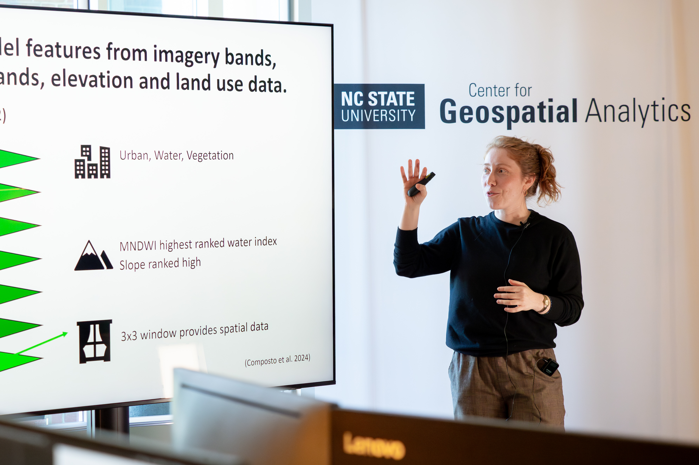

Rebecca Composto has completed her coursework and qualifying exams to become a Ph.D. candidate.

<!--more-->

Her dissertation focuses on testing and improving methods for mapping urban flooding using satellite imagery, and using these maps to assess impact. Ideally these improved flood maps can help emergency managers, city planners and every day residents recover from and prepare for future floods.

<figcaption>Rebecca presenting during a recent Ph.D. Geospatial Forum at the Center for Geospatial Analytics. Photo by Becky Kirkland.</figcaption>

Rebecca presented in front of a committee including her advisor Dr. Mirela Tulbure, Dr. Helena Mitasova, Dr. Georgina Sanchez, Dr. Gavin Smith for her oral exam. 

She is currently working on the second chapter of her dissertation, which explores how satellite- and process-based models can be leveraged together. Rebecca’s first chapter uses machine learning and Sentinel-2 satellite imagery to map Hurricane Ida flooding. You can read it <a href = 'https://rdcu.be/dPcyu'>here</a>. 