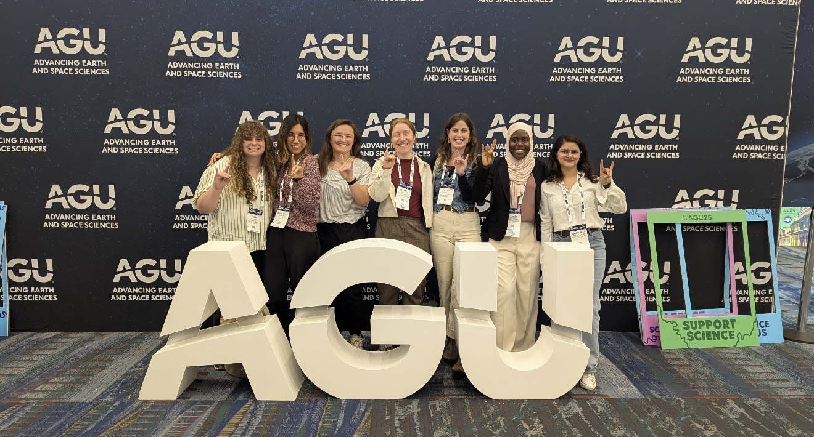
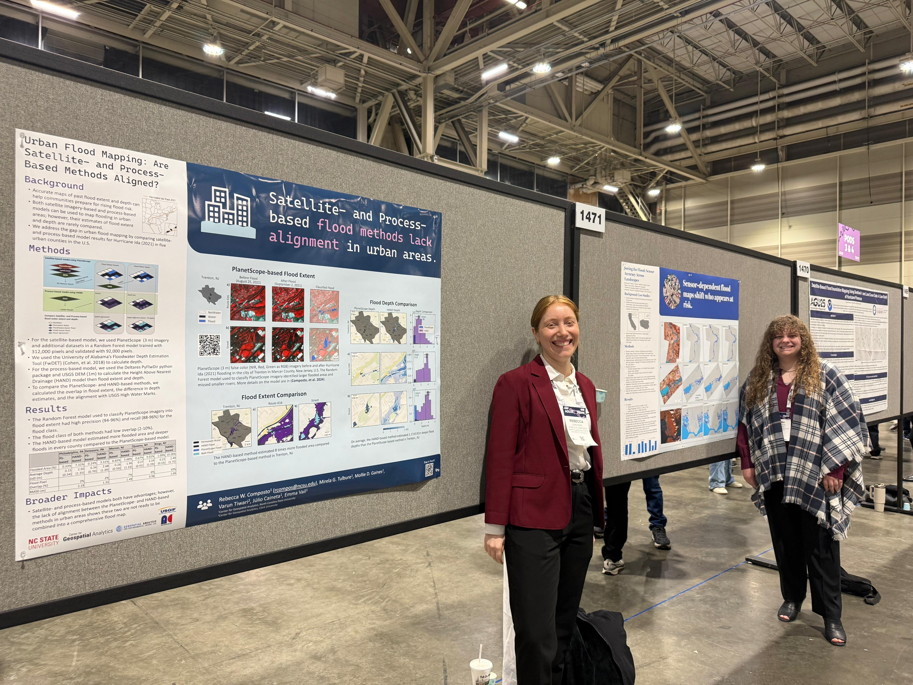
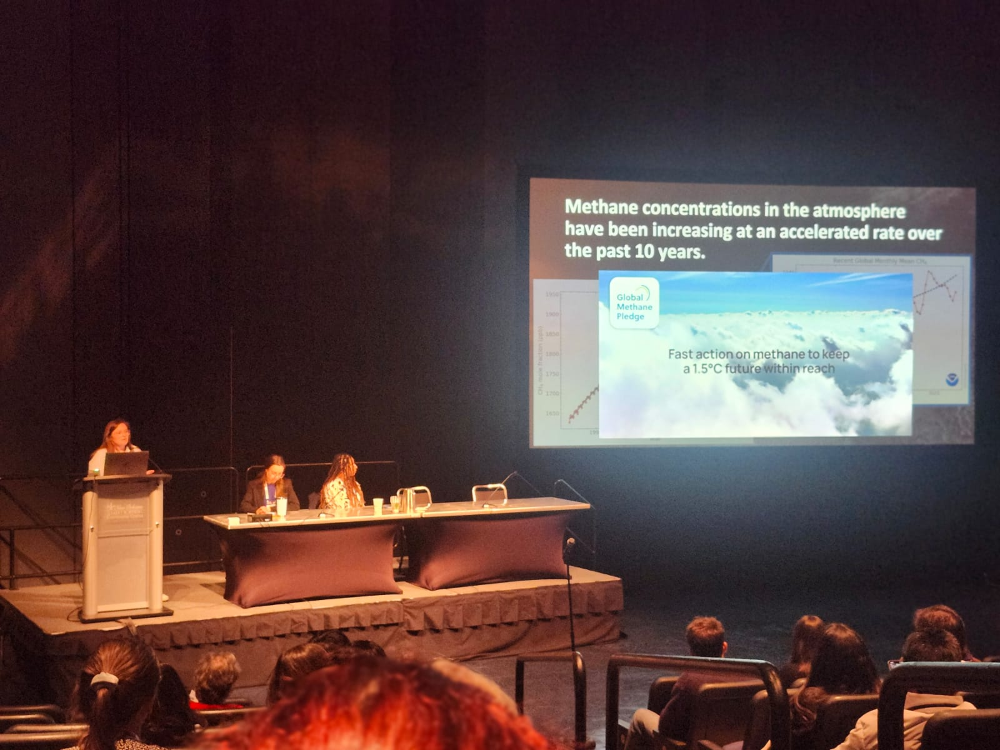
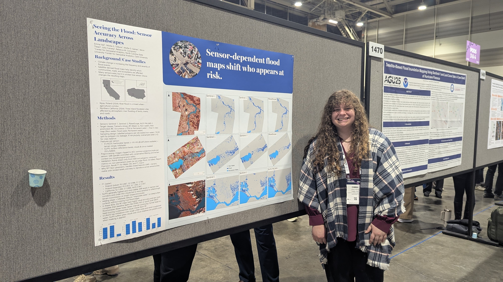

GAEC lab members Júlio, Rebecca, Mollie, Emma and Jillian attended the <a href = 'https://www.agu.org/annual-meeting'>American Geophysical Union Conference</a> in New Orleans in December.

<!--more-->

Mirela’s poster on multimodal geospatial foundation models was presented by Júlio. Read more in the <a href = 'https://agu.confex.com/agu/agu25/meetingapp.cgi/Paper/1910036'>conference abstract</a>. 

Júlio also presented a poster with undergraduate lab member Darcy about mapping urban flash flood extent from Hurricane Helene. The abstract is available <a href='https://agu.confex.com/agu/agu25/meetingapp.cgi/Paper/2003572'>here</a>.

Rebecca presented a poster on satellite and process-based methods for urban flood mapping. Her research focuses on mapping urban flooding. You can read the abstract <a href='https://agu.confex.com/agu/agu25/meetingapp.cgi/Paper/1894564'>here</a>.

Mollie gave an oral presentation about methane emissions from small water bodies. This was Mollie’s sixth time presenting at AGU’s fall meeting. Read her abstract <a href='https://agu.confex.com/agu/agu25/meetingapp.cgi/Paper/1928309'>here</a> and check out her presentation <a href='https://essopenarchive.org/users/535878/articles/1346067-impact-of-optical-satellite-imagery-spatial-scale-on-methane-emission-estimates-from-small-water-bodies'>here</a>.

Emma presented a poster on the accuracy of flood inundation detection across Earth Observation sensors. The abstract is available <a href='https://agu.confex.com/agu/agu25/meetingapp.cgi/Paper/1954354'>here</a>.

PhD Student Jillian, who recently joined the lab, also attended and gave two presentations. The first was about her work quantifying aquatic greenhouse gas flux from Lake Michigan estuaries through the Grand Valley State University Biology MS program. Read the abstract <a href='https://agu.confex.com/agu/agu25/meetingapp.cgi/Paper/1895848'>here</a>. 

Jillian also presented her work through the <a href='https://stemgateway.nasa.gov/public/s/course-offering/a0BSJ000000x13J2AQ/climate-change-research-initiative-internship-giss'>NASA Climate Change Research Initiative</a>, in which she developed an approach for monitoring algal bloom trends in New York. See more details <a href='https://agu.confex.com/agu/agu25/meetingapp.cgi/Paper/1946401'>here</a>. Jillian is excited to continue her research on methane emissions with the GAEC lab.

### Social Media Buzz:
<iframe src="https://www.linkedin.com/embed/feed/update/urn:li:share:7405309628726530048" height="1017" width="504" frameborder="0" allowfullscreen="" title="Embedded post"></iframe>