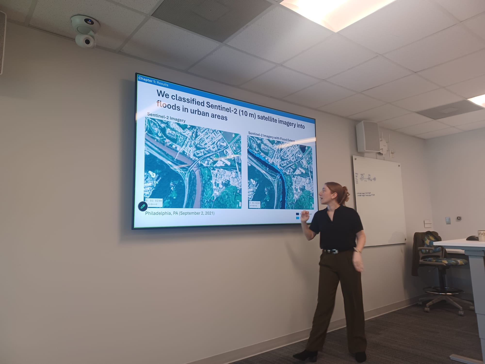

Dr. Composto has successfully defended her PhD titled "Leveraging satellite imagery for urban flood mapping and quantifying impacts."

<!--more-->

Dr. Composto has officially earned her doctorate in Geospatial Analytics at North Carolina State University. Her research utilizes satellite imagery to improve urban flood mapping techniques and map flood impact. Her dissertation chapters are as follows:
1. (published) <a href = 'https://doi.org/10.1007/s11069-024-06817-5'>Quantifying urban flood extent using satellite imagery and machine learning.</a>
2. (under review) <a href = 'https://doi.org/10.22541/essoar.15001292/v1'>Satellite-based flood extent and depth estimates lack alignment with terrain-based estimates in urban areas: A Hurricane Ida case study.</a>
3. (in preparation): Strengths and limitations of satellite-based flood maps for estimating building damages.

You can learn about Dr. Composto's research by watching her <a href = 'https://www.youtube.com/watch?v=HiKDMD0wHBc' >5-minute department presentation</a> or her <a href = 'https://www.youtube.com/watch?v=LujLnI57OAY&list=PL7dONoqMaCHbBl0-TBW3zuO02iAudw_SK&index=11' >30-minute museum presentation</a> for a public audience. During her four years at NC State she had several highlights:

- Research: Published the first chapter of her dissertation related to urban flood mapping
- Awards: $26,000+ in grants, fellowships, and travel awards
- Teaching: Co-instructor of an undergraduate GIS course that uses Python
- Mentorship: Advised students with course projects, independent research, and careers
- Service: Served on 3 departmental committees, developed and taught 2 GIS K-12 lessons 

Following her successful PhD defense, this summer Dr. Composto will be submitting her third dissertation chapter and looking for opportunities that allow her to pursue her passion for conducting emergency management research with satellite imagery and communicating hazard risk with the public. 