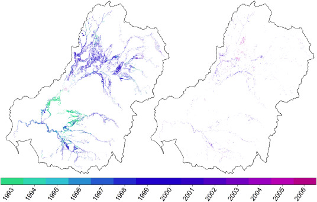

Surface water is a critical resource in semi-arid areas, which cover one-third of the globe. In Australia, competing water demands, climate and land use changes, and multi-year droughts (Millennium Drought) have led to water shortages. This has highlighted the need to figure out how much water can be used for irrigation and how much water needs to be reserved for “environmental flows” which mimic the natural flooding and serve as lifelines for native vegetation.

We analyzed time-series of satellite and hydro-climatic data to quantify flooding, surface water, and their drivers of change and vegetation response to flooding across Australia’s breadbasket, the Murray-Darling Basin (MDB), a large  (>1 million km2) dryland basin, the size of the U.S. 4 corner states from 1986 to 2011. The three decades investigated represented a period of extreme hydroclimatic variability, including the Millennium Drought (1999-2009), the worst drought recorded for southeastern Australia, followed by some of the wettest years on record (2010-11 La Niña years).  Specific objectives included: 
 
<b>SURFACE WATER DYNAMICS ACROSS SPACE AND TIME</b> 
 We used satellite data and high-performance computing to develop the first spatially detailed and seasonally continuous surface water and flooding extent dynamics quantification at sub-continental scale at then the highest available temporal (every 16-days) and spatial resolution (30m) by processing ~5TB (25,000 compressed images) of Landsat satellite data over three decades (<a href="https://www-sciencedirect-com.prox.lib.ncsu.edu/science/article/pii/S0034425716300621">Tulbure et al. 2016</a>). Highlights of this work were featured by NASA Landsat Science <a href="https://earthobservatory.nasa.gov/images/88292/boom-and-bust-water-supplies-in-southeast-australia">here</a> and chosen as NASA’s image of the day in July 2016, see here.
 This work allowed us to quantify the basin’s dramatically changing expanse of surface water and show how the Millennium Drought and following La Niña deluges impacted surface water throughout the MDB. 
 We made the satellite-derived surface water and flooding dynamics datasets freely available (<a href="http://doi.org/10.5281/zenodo.2441784">Tulbure and Broich, 2019</a>).

 

We then showed that besides extreme climate variability, land use is as important in driving surface water extent dynamics, particularly at the local scale, suggesting that measures that we can implement locally based on decisions on how we use our land can have a significant impact on water extent dynamics (<a href="https://www-sciencedirect-com.prox.lib.ncsu.edu/science/article/pii/S0048969718347466">Tulbure and Broich, 2019</a>). 

 
<b>DRIVERS OF SURFACE WATER DYNAMICS</b>
We used the time series of surface water and flooding dynamics derived above in a spatial modeling framework (<a href="https://hess.copernicus.org/articles/20/2227/2016/">Heimhuber et al. 2016</a>) to develop statistical flood modeling as a function of hydro-climatic variables (river flow, rainfall, soil moisture, evapotranspiration). We showed that in addition to river flow, local climate conditions influence the long-term dynamics of surface water, particularly in the extended and unregulated floodplain systems in the northwest of the basin (<a href="https://agupubs.onlinelibrary.wiley.com/doi/full/10.1002/2016WR019858">Heimhuber et al. 2017</a>).  To overcome the challenge of not being able to capture ephemeral floods with the 16-day revisit period of Landsat, we showed that statistical models and image blending (of Landsat and MODIS using STARFM) could produce consistent 8-day 30 m inundation mapping (<a href="https://www.sciencedirect.com/science/article/abs/pii/S0034425718301603">Heimhuber et al. 2018</a>).
We also used GRACE data to understand how the long-term total water storage anomalies were related to stream salinity trends (<a href="https://www-sciencedirect-com.prox.lib.ncsu.edu/science/article/pii/S0303243418310675">Heimhuber et al. 2019</a>).

<b>VEGETATION RESPONSE TO FLOODING</b>
First, we mapped and modeled how vegetation responds to water availability across the entire Murray-Darling Basin by linking flooding history (derived above) with vegetation responses. We used the Landsat data record to quantify where and when vegetation green-up occurred in the MDB, modeled how that green-up varied with rainfall and flooding patterns, and documented how this response relationship changed over time. We showed that the onset of the Millennium Drought caused dramatic shifts in the spatial patterns of vegetation response and the role of flooding (<a href="https://www.google.com/url?q=https://www-sciencedirect-com.prox.lib.ncsu.edu/science/article/pii/S0034425718301895&sa=D&source=docs&ust=1677085258874915&usg=AOvVaw1nkYaM-433INmlk7Alp4l9">Broich et al. 2018</a>). Our results were featured by NASA Science in the “Rain Showers, Flowers, and Floods—Understanding How Vegetation Responds to Flooding and Drought in Australia’s Breadbasket” article <a href="https://landsat.gsfc.nasa.gov/article/rain-showers-flowers-and-floods-understanding-how-vegetation-responds-to-flooding-and-drought-in-australias-breadbasket/">here</a>. 
<figure>
  
  <figcaption>Figure 7 from Broich et al. Years of the first (left) and the second (right) detected breakpoints.</figcaption>
</figure>
Second, we quantified floodplain tree dieback using airborne LiDAR, and hyperspectral data and its relationship with flooding (derived above from Landsat time series). To achieve this aim, we first developed novel algorithms to map individual trees from the LiDAR point cloud (<a href="https://www-sciencedirect-com.prox.lib.ncsu.edu/science/article/pii/S0034425715301966">Shendryk et al. 2016</a>). We then used the delineated trees to classify their dieback using random forest algorithms based on field, airborne LiDAR, and hyperspectral data (<a href="https://www-sciencedirect-com.prox.lib.ncsu.edu/science/article/pii/S0034425716303868">Shendryk et al. 2016</a>). We upscaled this information to the site level using radar, very-high-resolution imagery, and LiDAR data (<a href="https://www.google.com/url?q=https://www-sciencedirect-com.prox.lib.ncsu.edu/science/article/pii/S0303243418303155&sa=D&source=docs&ust=1677085258868349&usg=AOvVaw3vugK2_4r7l3MUvvgs1JRN">Shendryk et al. 2018</a>).

Funding: The Australian Research Council supported this work through a Linkage Project in collaboration with the Murray-Darling Basin Authority [<a href="https://app.dimensions.ai/details/grant/grant.3931542">Grant Number LP130100408</a>].