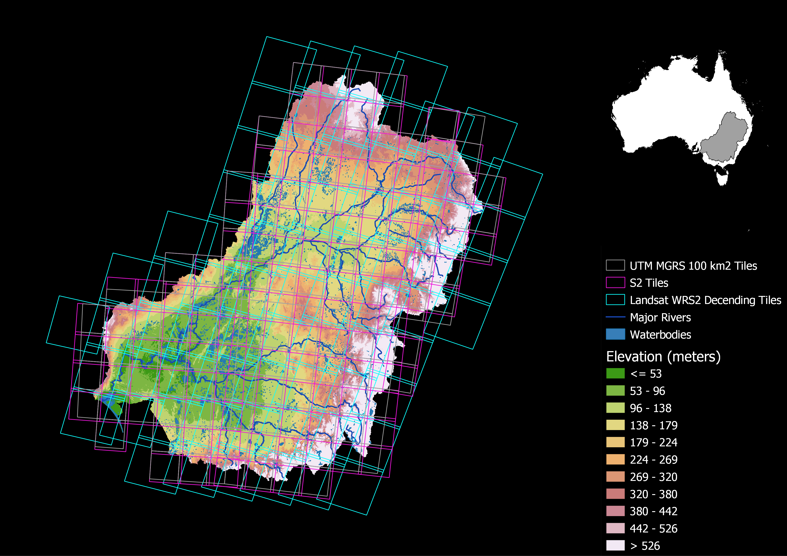

Floods are the most significant climate change-related hazards in terms of life loss and economic damage. Effective and immediate disaster response management can reduce the impact of floods, but it requires near real-time information on flood occurrence, typically derived based on Earth Observation data. Several regional to global surface water data sets have been developed using optical time series, either from MODIS-type sensors with coarse spatial resolution but daily frequency or based on the entire Landsat archive. Despite its high spatial resolution, the 16-day repeat frequency of Landsat means that short lived hazardous flooding and the maximum extent of large floods are likely missed. Meanwhile, spatially coarser MODIS-type sensors may miss small water bodies and floods entirely. In addition, two limitations when mapping inundation with optical data have been detecting water under vegetation and cloud obscuration, which often coincides with floods. Both issues can be overcome by fusing multiple optical with synthetic aperture radar (SAR) data, taking advantage of complementary observation properties, including SAR’s ability to penetrate through clouds. Thus, combining observations and spectral properties of the newly available Sentinel 1 SAR (S1) and Sentinel 2 (S2) series of satellites with Landsat 8 (L8) holds promise for global surface water and flood mapping with improved spatial and temporal resolution and accuracy. To accurately capture the maximum extent of all floods in near real-time, our key objectives are to (1) map flooding dynamics globally, using machine learning applied to time-series of multi-sensor optical (L8, S2) and radar (S1) time series data, (2) assess the accuracy of the mapped flood extent, and (3) test the ability of our algorithms to map (a) ephemeral floods in a dynamic dryland river system (b) a complex delta including inundated vegetation in Western Canada (leveraging field validation data on the extent of inundated vegetation collected during NASA’s Arctic Boreal Vulnerability Experiment), and (c) extreme flooding in North Carolina.

Our work has applied machine learning algorithms to map floods globally (<a href="https://agu.confex.com/agu/fm22/meetingapp.cgi/Paper/1140009">Tulbure et al 2022</a>, <a href="../static/media/livingplanet.jpg/">Tulbure et al 2022</a>, <a href="https://agu.confex.com/agu/fm21/meetingapp.cgi/Paper/911456">Tulbure et al 2021</a>). We also showed that we can detect more ephemeral flooding events when using data from three sensors provided by NASA’s Harmonized Landsat-Sentinel 2 data product, HLS (<a href="../publication/2022-01-29-ISPRS-Tulbure-Broich/">Tulbure et al 2022</a>). 

Our findings show that high satellite temporal resolution is imperative to fully capture flood behavior, making ready-to-use harmonized satellite products like HLS very valuable to flood mapping. Our work was highlighted by NASA <a href="https://landsat.gsfc.nasa.gov/article/time-is-of-the-essence-when-monitoring-dryland-floods/">here</a>. 

This is an ongoing project funded by a NASA Terrestrial Hydrology Project (Grant Number 80NSSC21K0980).  
