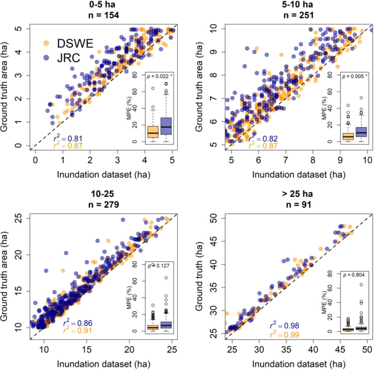
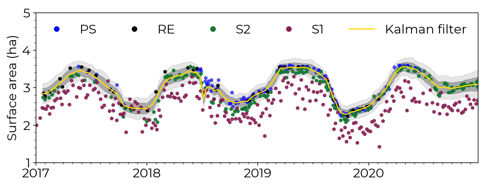
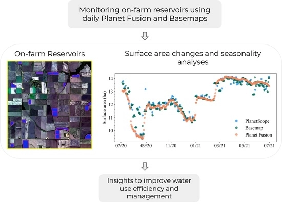
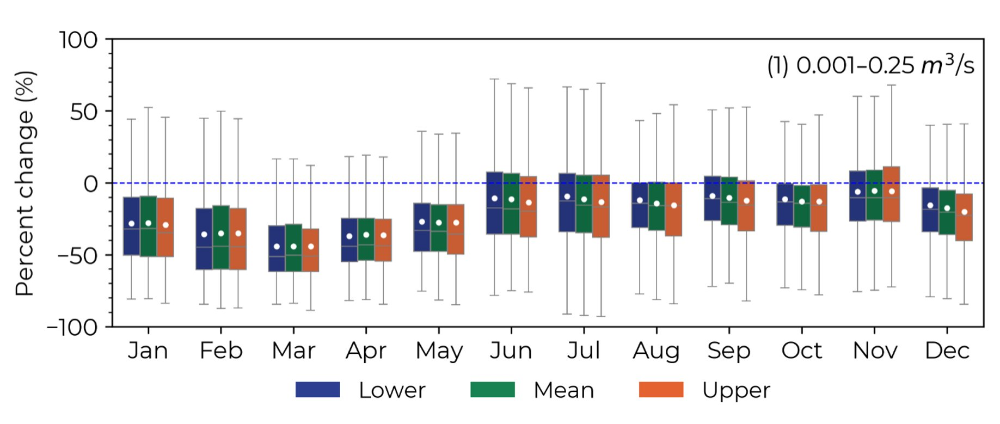

Fresh water stored by small on-farm reservoirs (SRs), which are small water bodies, is a fundamental component of surface hydrology and is critical for meeting global irrigation needs. Farmers use SRs to store water during the wet season for crop irrigation during the dry season. SRs can also contribute to downstream water stress by decreasing stream discharge and peak flow in the watersheds where they are built. There are more than 2.6 million SRs in the US alone, and many SRs were constructed during the last 40 years. Despite their importance for crop irrigation, SRs are poorly quantified bc (1) they are small (< 50 ha), (2) there are millions of them around the world, and (3) they occur on private land. Satellite data allow us to quantify SR water area and volume across space and time.

In a first study, funded by NASA, we focused on a major agricultural region in eastern Arkansas and used two Landsat-derived surface water data sets to quantify SR dynamics. We showed that while their seasonality can be captured well with the 30 m resolution of Landsat, the error in surface area for the SRs < 5 ha is high (20 %, <a href="https://www-sciencedirect-com.prox.lib.ncsu.edu/science/article/pii/S0378377420322381?dgcid=author">Perin et al. 2021</a>):

In a second study, we combined data from several sensors of various spatial, temporal, and spectral resolutions, including Sentinel 1 (S1), Sentinel 2 (S2), PlanetScope (PS), & RapidEye (RE) using a Kalman filter approach to show that when using all sensors combined we can quantify sub-weekly area changes in SRs, <a href="https://www-sciencedirect-com.prox.lib.ncsu.edu/science/article/pii/S0034425721005162">Perin et al. 2022</a>.

We further showed that using analysis-ready datasets, including daily 3m Planet Fusion & Basemap, we can monitor SRs daily (<a href="https://www.mdpi.com/2072-4292/13/24/5176">Perin et al. 2021</a>).

We also quantified the impact that SRs have on surface hydrology by integrating the remote sensing derived reservoir area with the SWAT+ hydrological model. We showed that the impact of SRs varies inter- and intra-annually and is not equally distributed across the watersheds (Perin et al., In Review).

On-farm reservoir (OFRs) dynamics, which are small water bodies that have an important role in irrigation globally but are poorly quantified bc (1) they are small (< 50 ha), (2) there are millions of them around the world, and (3) they occur on private land

However, modeling the impact of OFRs on surface hydrology remains a challenge because they are so abundant and have frequent fluctuations in surface area and water volume. Prior to the recent availability of satellite data, widespread monitoring of OFRs’ surface area and water volume across space and time was impossible due to temporal latency of satellite observations. The goal of this project, therefore, is to harness a multi-sensor satellite imagery approach to reduce observation latency and improve surface hydrology modeling, with the aim of supporting more efficient management of OFRs and mitigation of their downstream impacts. 

