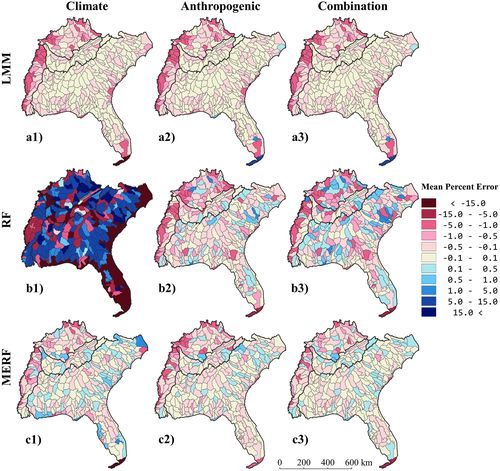

Surface water is the most readily accessible water resource and provides an array of ecosystem services, but its availability and access are stressed by changes in climate, land cover, and population size. Understanding drivers of surface water dynamics in space and time is key to better managing our water resources. However, few studies estimating changes in surface water account for climate and anthropogenic drivers both independently and together. We used 19 years (2000–2018) of the newly developed Dynamic Surface Water Extent Landsat Science Product in concert with time series of precipitation, temperature, land cover, and population size to statistically model maximum seasonal percent surface water area as a function of climate and anthropogenic drivers in the southeastern United States (<a href="https://agupubs.onlinelibrary.wiley.com/doi/full/10.1029/2021WR031484">Gaines et al. 2022</a>). We fitted three statistical models (linear mixed effects, random forests, and mixed effects random forests) and three groups of explanatory variables (climate, anthropogenic, and their combination) to assess the accuracy of estimating percent surface water area at the watershed scale with different drivers. We found that anthropogenic drivers accounted for approximately 37% more of the variance in the percent surface water area than the climate variables. The combination of variables in the mixed effects random forest model produced the smallest mean percent errors (mean −0.17%) and the highest explained variance (R 2 0.99). Our results indicate that anthropogenic drivers have greater influence when estimating percent surface water area than climate drivers, suggesting that water management practices and land-use policies can be highly effective tools in controlling surface water variations in the Southeast.

Water stress is compounded by agricultural and urban areas using water-intensive practices. Understanding spatial and temporal drivers of surface water dynamics—e.g., temperature, precipitation, and land-use/land-cover change (LULCC)—is key to more effectively managing resources and limiting the effects of water stress. So far, these drivers have been assessed mainly using local-scale hydrological models, with many not accounting for human drivers such as population density and LULCC or land use intensity. We produced scenario-based surface water area projections to 2100 that combined land-cover and climate projections under different development and emissions scenarios for the southeastern United States (<a href="https://agupubs.onlinelibrary.wiley.com/doi/full/10.1029/2021WR031484">Gaines et al. 2022</a>). We used a data-driven, machine learning model fitted with historic Landsat imagery, land-use/land-cover, and climate data to develop surface water area projections with land-use/land-cover and climate projection scenario data. For the climate projection data, we used monthly average maximum temperature and precipitation values from five statistically downscaled Global Climate Models for two Representative Concentration Pathways (RCPs), RCP4.5 and RCP8.5 from 2006-2100. We combined these emissions scenarios with land-cover projection data produced by the USGS’s FOR-SCE model for four IPCC Special Report on Emission Scenarios (SRES): A1B, A2, B1, and B2. We compared the surface water projections from our data-driven model and a process-based model—the US Forest Service Water Supply Stress Index model. This assessment shows the ability of data-driven models to produce projections similar to process-based models while avoiding extensive parameterization. We expect to find an uneven distribution of projected change in percent surface water area, where the RCP8.5-SRES A2 scenario has the largest and most uneven distribution of projected change. We also expect to find watersheds with more forest-dominated land cover will have the smallest amount of projected change. These results highlight our ability to 1) use data-driven models to project changes in surface water based on satellite imagery and climate and land cover projections, and 2) mitigate changes to water access with land use management (<a href="https://agu.confex.com/agu/fm22/meetingapp.cgi/Paper/1118175">Gaines et al. 2022</a>).

