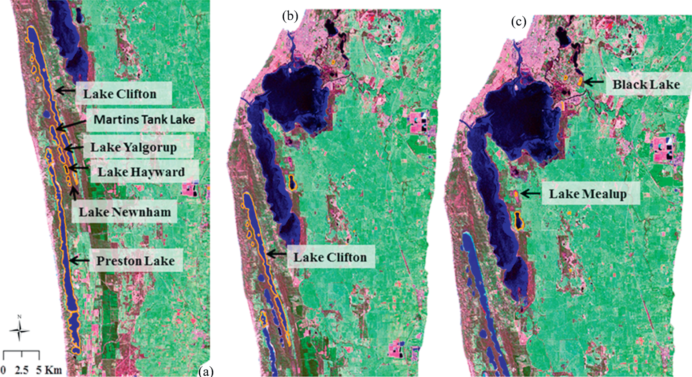

Located in the southwest of Western Australia, the Swan Coastal Plain (SCP) is a global biodiversity hotspot with over 1,500 wetlands. More than 70% of the wetlands have been lost since European settlement. The SCP is located in an area affected by recent climate change that also experiences rapid urban development, as the city of Perth has been expanding over time, and ground water abstraction for urban consumption. 

We used Landsat TM and ETM+ imagery from 1999 to 2011 to automatically derive a spatially and temporally explicit time-series of surface water body extent on the SCP based on decision trees. We provided the first spatio-temporally dynamic map of the water bodies of the SCP.

<video width = "256px" height="144px">
<source src="A1_cbrenfr2.mp4" type="video/mp4">
Video not available
</video>

We made the dataset freely available <a href="https://datadryad.org/stash/dataset/doi:10.5061/dryad.50003">here</a>, which was downloaded more than 100 times and was used by government agencies such as the Department of Water and Environmental Regulation of Western Australia (see testimonial below).

<blockquote>
<i>“Dr Tulbure's data set has contributed to research and understanding of water 
dynamics in the Vasse-Wonnerup Estuary, Ramsar listed for its importance for 
international migratory birds, Lake Clifton and Loch McNess, as well as in many other 
water bodies. My department now uses her methodology to extend this mapping beyond 
the period covered by her work. In addition, the spatial layers were used to better understand the wetting/drying of the Ramsar listed Lake Clifton in relation to rainfall and the water balance.” </i>

 - Mathematical Modeler at the Department of Water and Environmental Regulation of Western Australia

</blockquote>

We further analyzed the number of water bodies in relation to climate variables and showed that the number, mean size, and total area of water bodies experience high seasonal variability with highest numbers in winter and lowest numbers in summer. We published our findings in the ISPRS Journal of Photogrammetry and Remote Sensing, Tulbure and Broich (2013), <a href=https://www.sciencedirect.com/science/article/abs/pii/S0924271613000300>here</a>.

We then used graph theory connectivity analysis, a framework typically used in mathematics, social sciences and engineering and more recently applied to ecological systems, to understand which body of water functioned as a vital “stepping stone” in the network on the SCP, connecting other habitats, and thus having a high potential for conservation. The main innovation of the work was integrating dynamic habitats or network “nodes”—the water bodies we previously mapped with Landsat time-series and decision trees— with the novel graph theory framework. We published this work in Environmental Research Letters (<a href=https://iopscience.iop.org/article/10.1088/1748-9326/9/11/114012>Tulbure et al. 2014</a>). Our work was picked up by several outlets including Environmental Research Web: <a href=https://iopscience.iop.org/article/10.1088/1748-9326/9/11/114012>"Graph theory shows where to conserve"</a> and EurekaAlert, ScienceDaily, and Earth Environment News: <a href=https://www.sciencedaily.com/releases/2015/01/150128093555.htm>"Satellite study identifies water bodies important for biodiversity conservation"</a>.

